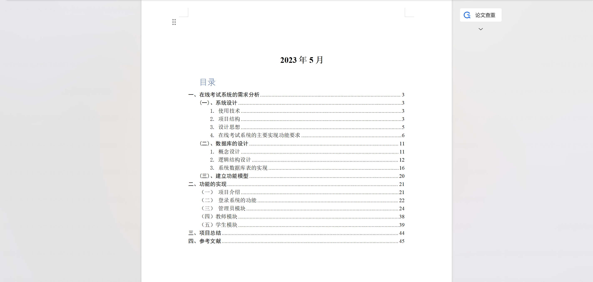
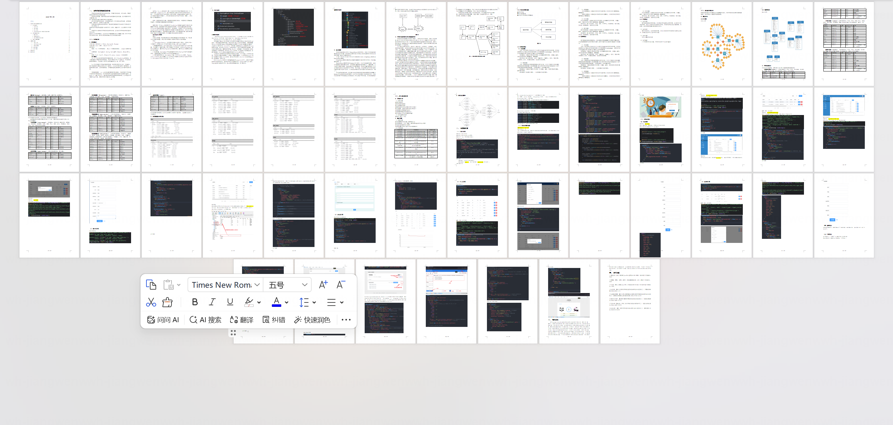
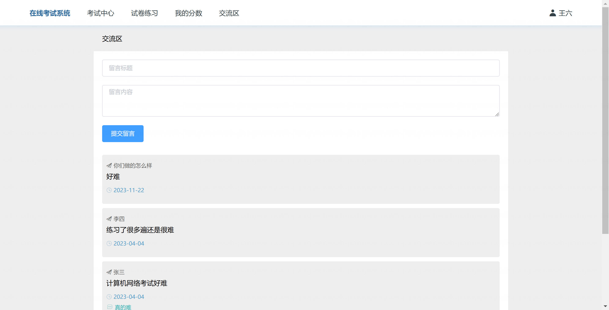
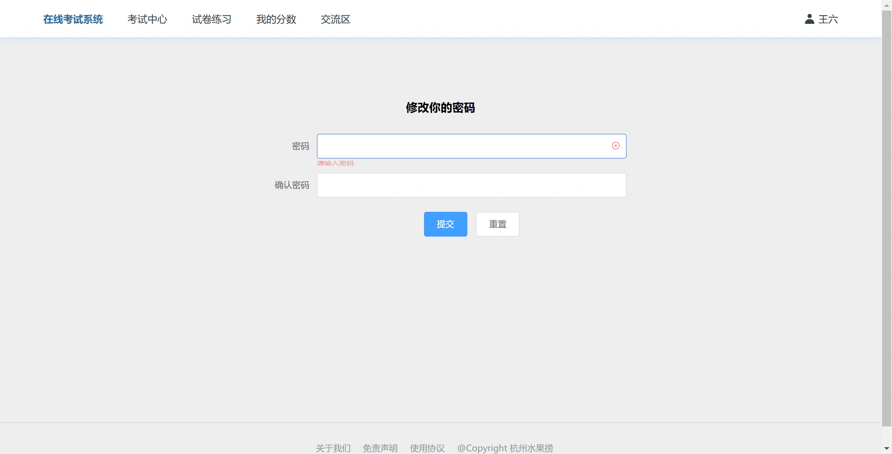
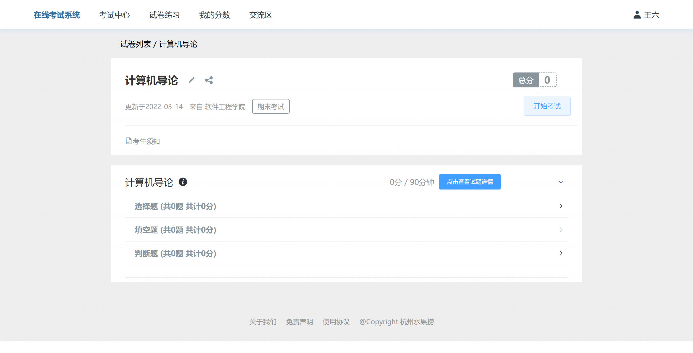
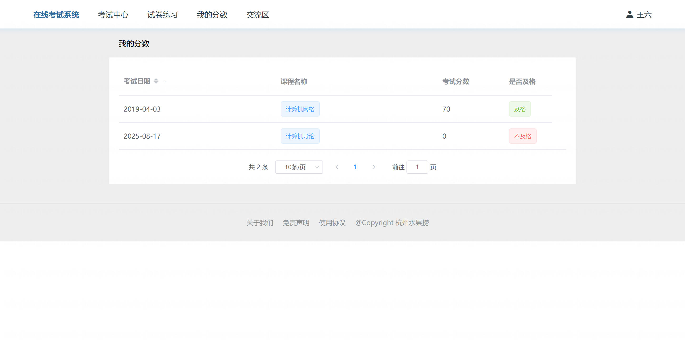
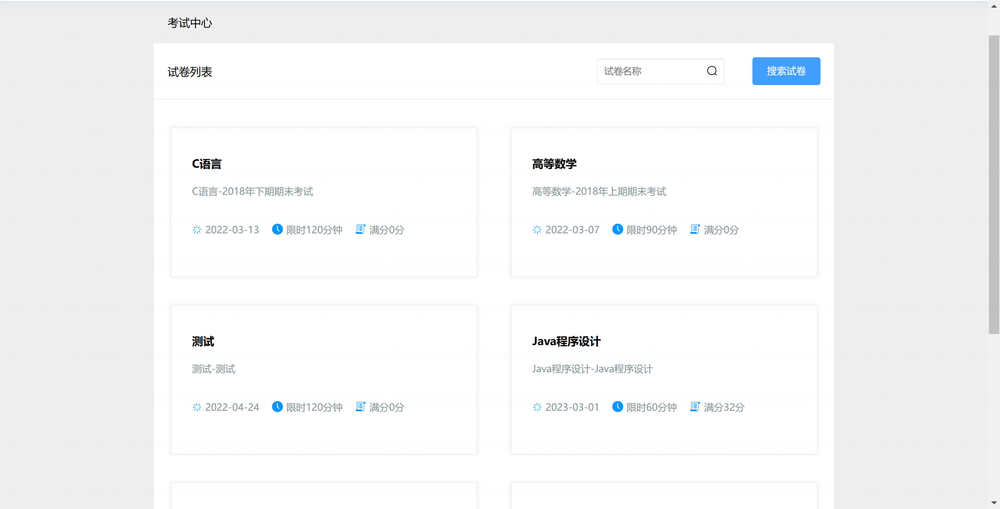
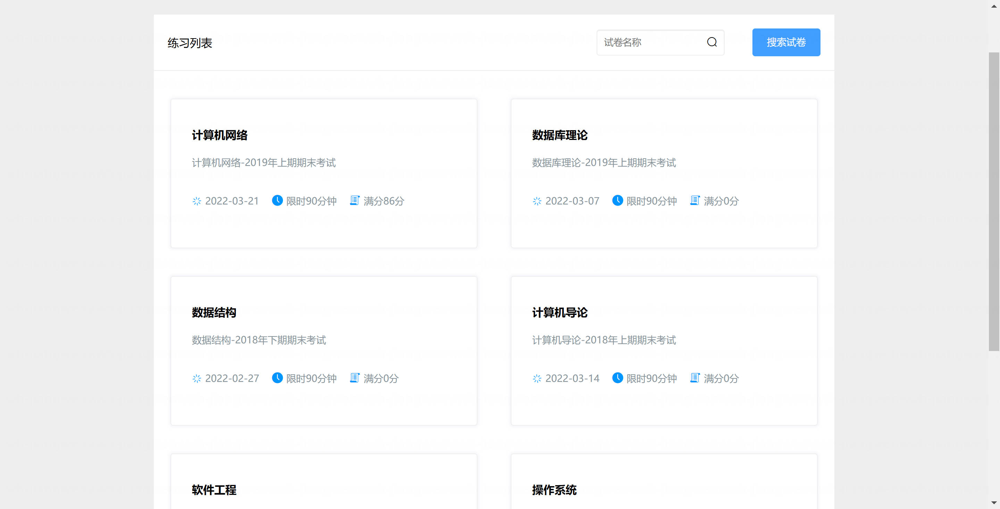
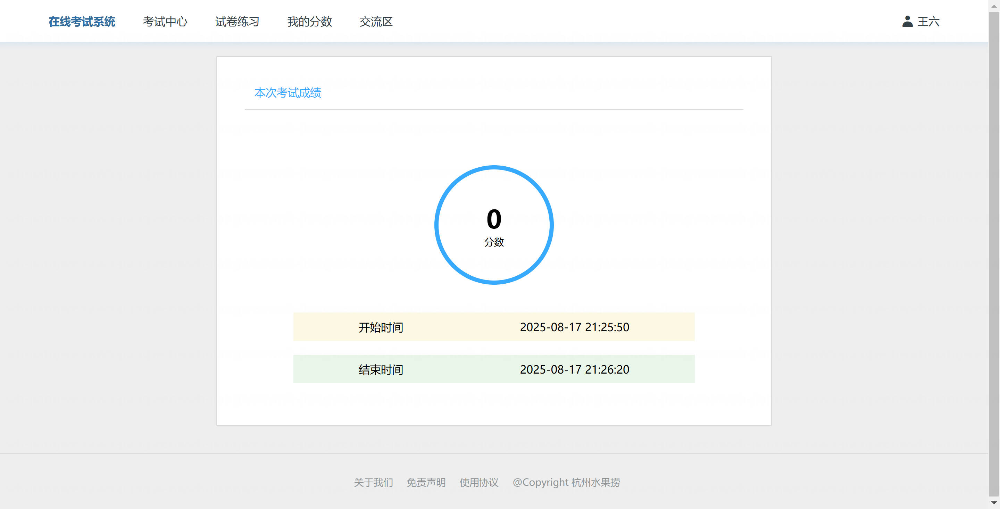

基于Springboot的在线考试系统（程序+论文）
=

### 完整代码获取地址：从戎源码网 ([https://armycodes.com/](https://armycodes.com/))
### 作者微信：19941326836  QQ：952045282 
### 承接计算机毕业设计、Java毕业设计、Python毕业设计、深度学习、机器学习
### 选题+开题报告+任务书+程序定制+安装调试+论文+答辩ppt 一条龙服务
### 所有选题地址https://github.com/nature924/allProject

一、项目介绍
---

基于 Spring Boot + Vue 的在线考试系统，系统角色为 管理员 / 教师 / 学生，主要功能如下：

管理员：
基本操作：登录、登出、修改密码、获取/修改个人信息
用户管理：教师/学生/管理员的增删改查、分页与筛选
考试管理：新增/查询/分页/删除考试
试卷管理：创建试卷、查看试卷题目（选择/填空/判断按类型返回）、从试卷删除题目
题库管理：选择题、填空题、判断题的 CRUD

教师：
基本操作：登录、登出、修改密码、个人信息维护
题库维护：管理课程题目（增删改查）
组卷与管理：创建/编辑试卷、查看试卷题目、删除试卷题目
批改评分：查看学生提交、批改/发布成绩

学生：
基本操作：登录、登出、查看/修改个人信息
参加考试：获取试卷题目（按题型返回）、提交答卷
查看成绩：查看个人考试成绩与历史记录

二、项目技术
---
- 编程语言：Java
- 数据库：MySQL
- 项目架构：B/S架构
- 前端技术：JSP
- 后端技术：Spring、SpringMVC、MyBatis

三、运行环境
---
- 操作系统：Windows、macOS都可以
- JDK版本：JDK1.8以上都可以
- 开发工具：IDEA、Ecplise、Myecplise都可以
- 数据库: MySQL5.7以上都可以
- Tomcat：任意版本都可以
- Maven：任意版本都可以

四、运行截图
---
### 论文截图：

### 程序截图：

